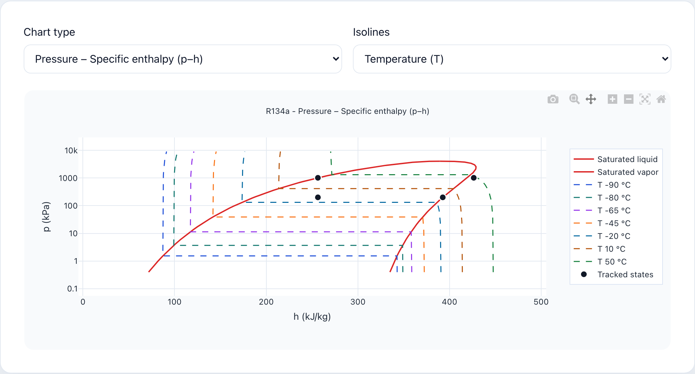
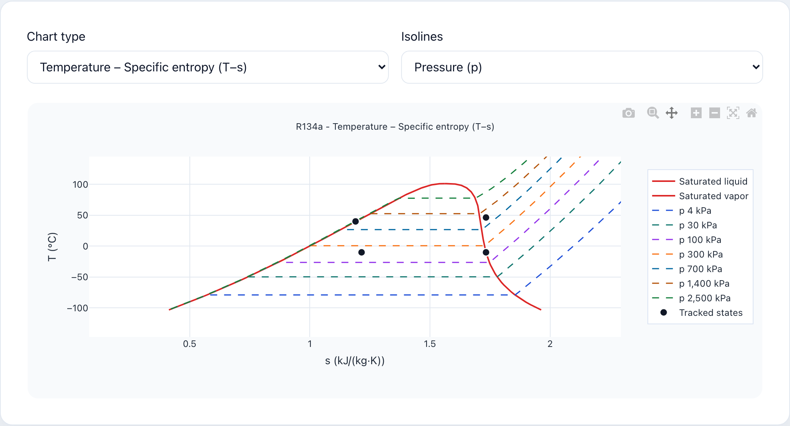
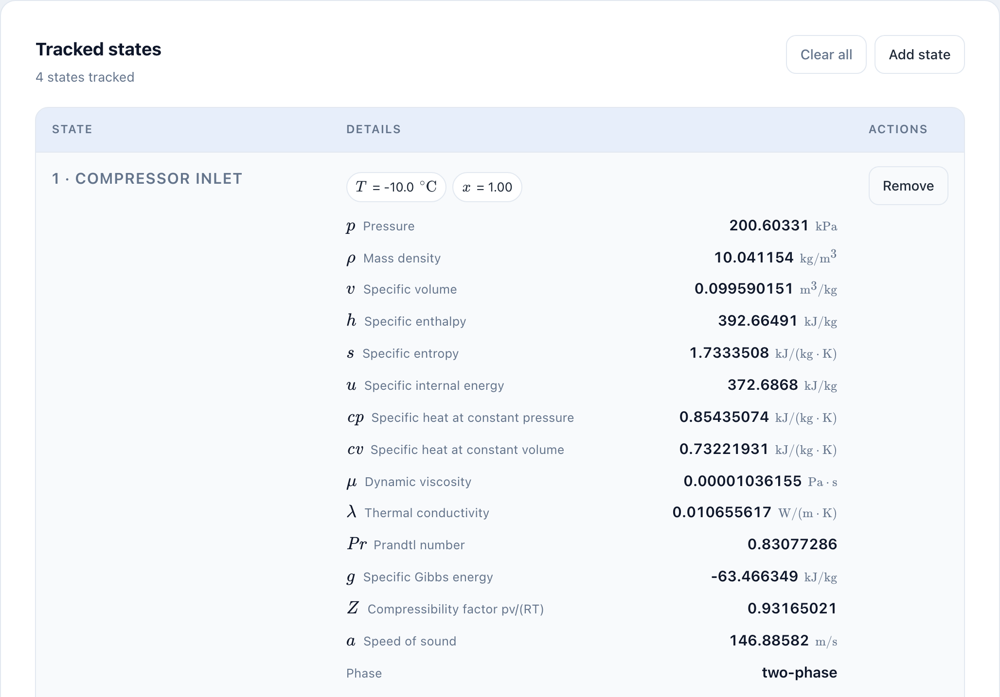
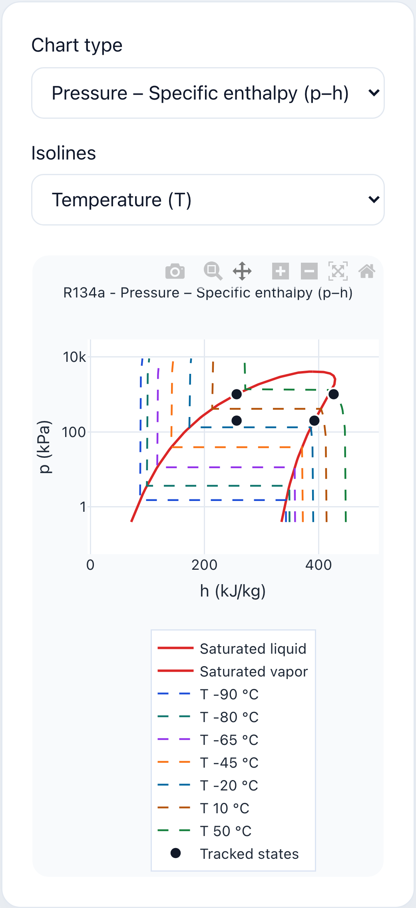
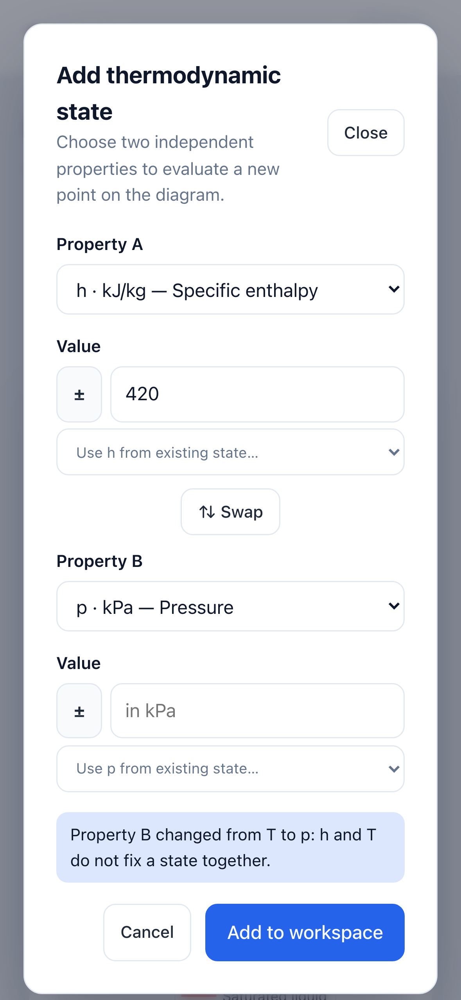

# Thermoprops

**[Open Thermoprops → luisbedoia.github.io/thermoprops](https://luisbedoia.github.io/thermoprops/)**

Free calculator for thermodynamic properties of fluids and refrigerants. It
runs entirely in the browser, on [CoolProp](https://coolprop.org/) compiled
to WebAssembly.



## Features

- 30 fluids and refrigerants: water, air, ammonia, CO₂, nitrogen, R134a,
  R410A, R32, R1234yf, propane…
- Fix any two independent properties (p, T, ρ, h, s, u, x) and get the full
  state, transport properties included.
- p–h, T–s, h–s, p–v, T–v and p–T diagrams, with the saturation dome,
  isolines and your states plotted together.
- °C, K or imperial units.
- Shareable links: fluid, units and states are stored in the URL.
- Works on phones, offline once loaded, and can be installed as an app.





<p align="center">
  
  &nbsp;&nbsp;
  
</p>

## Development

Properties come from
[`@luisbedoia/coolprop-rs-wasm`](https://github.com/luisbedoia/coolprop-rs),
published on GitHub Packages: installing it needs a token with
`read:packages` in `NPM_TOKEN` (`.npmrc` reads it).

```bash
NPM_TOKEN=<token> npm ci
npm run dev       # development server
npm test          # unit tests
npm run build     # type check and production build
```

Pushing a `v*` tag deploys to GitHub Pages.

## Credits

All property values are computed by CoolProp. If you use them in academic
work, please cite:

> Bell, I. H.; Wronski, J.; Quoilin, S.; Lemort, V. Pure and Pseudo-pure
> Fluid Thermophysical Property Evaluation and the Open-Source Thermophysical
> Property Library CoolProp. *Ind. Eng. Chem. Res.* **2014**, 53 (6),
> 2498–2508. [doi:10.1021/ie4033999](https://doi.org/10.1021/ie4033999)

Developed by the Department of Mechanical Engineering, Universidad de
Antioquia.

## License

MIT
